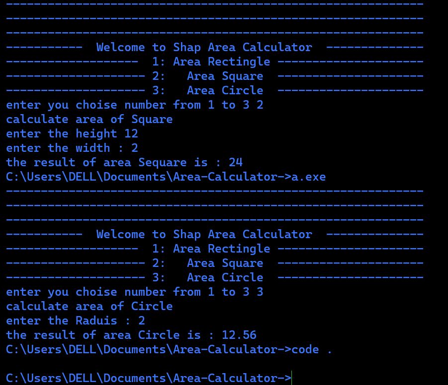

# Area-Calculator-
Create an Area Calculator console application, where user can choose between calculating area of square, rectangle and circle, then the application asks for the required inputs, and finally print the output on screen

<h3>How to run the project</h3>
<li>open cmd tap g++ clsArea.cpp after click enter</li>
<li>will create auto file executable a.exe</li>
<li>acces on a.exe and type enter</li>

<h3>Demo About The Project</h3>

<h3>Screenshot About Project</h3>

